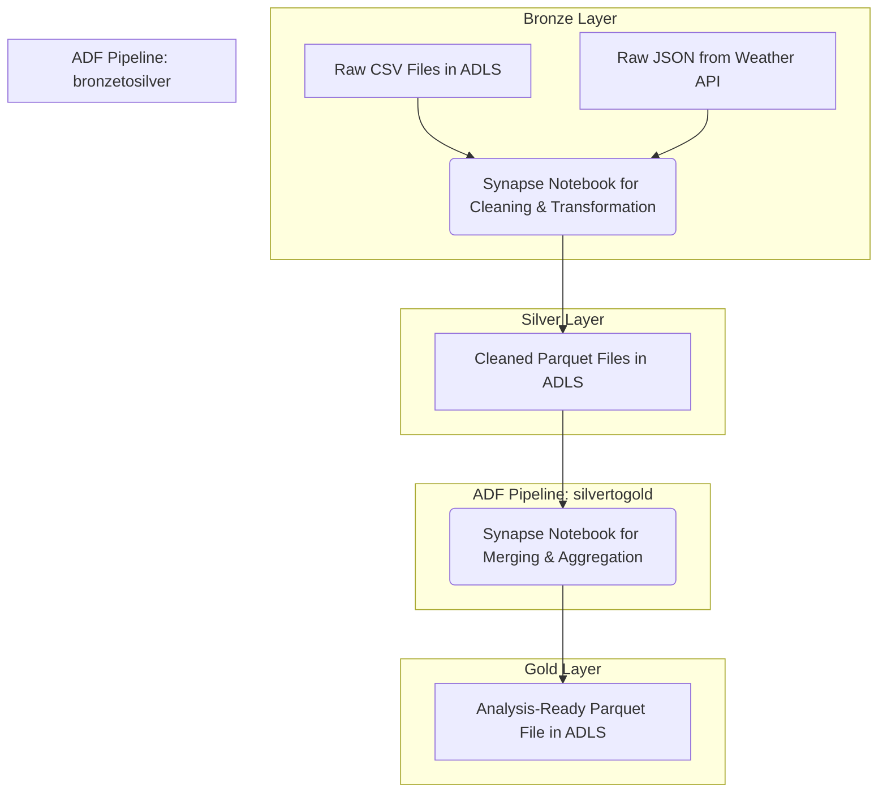

# Bee Haven: An End-to-End Azure Data Engineering Pipeline


This project is a practical, hands-on implementation of a modern data pipeline using Microsoft Azure services. It was developed as a key learning tool to prepare for and successfully pass the **Microsoft Azure Data Fundamentals (DP-900)** certification exam.

## Project Overview

Bee Haven, a beekeeping collective, needed to modernize its data handling by integrating historical hive data with new, incoming sensor readings. This project solves that challenge by building an automated, scalable, and robust ETL (Extract, Transform, Load) pipeline that processes raw data and refines it into an analysis-ready format.

The pipeline ingests batch data from hive sensors, enriches it with external weather data via an API, performs complex cleaning and transformations, and structures it according to the Medallion Lakehouse architecture.

***

## Architecture: The Medallion Lakehouse

The project follows the Medallion architecture to ensure data quality and governance, progressively refining data through three layers within Azure Data Lake Storage Gen2. This GIF shows the final folder structure in Azure Blob Storage.


* **🥉 Bronze Layer:** Ingests and stores raw, unaltered source data.
* **🥈 Silver Layer:** Contains cleaned, validated, and standardized data in the efficient Parquet format.
* **🥇 Gold Layer:** Stores fully aggregated and business-ready data, optimized for analytics and reporting.

### Architectural Diagram

***

## Technology Stack
* **Cloud Platform:** Microsoft Azure
* **Data Storage:** Azure Data Lake Storage (ADLS) Gen2
* **Orchestration:** Azure Data Factory (ADF)
* **Data Transformation:** Azure Synapse Analytics (Notebooks)
* **Primary Language & Libraries:** Python (Pandas for data manipulation, Scikit-learn for outlier detection)

***

## Repository Structure

The project files are organized as follows to allow for easy replication.

```
bee-haven-azure-pipeline/
│
├── gifs/
│   ├── BlobStorageStructure.gif
│   ├── bronzetosilverpipeline.gif
│   ├── silvertogoldpipeline.gif
│   └── PipelineExecution.gif
│
├── notebooks/
│   ├── notebook_bronze_to_silver.ipynb
│   └── notebook_silver_to_gold.ipynb
│
├── raw-data/
│   ├── flow_schwartau.csv
│   ├── humidity_schwartau.csv
│   ├── temperature_schwartau.csv
│   └── weight_schwartau.csv
│
└── README.md
```
* **/gifs**: Contains the animated GIFs demonstrating the project's components and execution.
* **/notebooks**: Contains the Synapse notebooks with the Python data transformation logic.
* **/raw-data**: Contains the initial raw CSV data for project replication.

***

## Pipeline Workflow

The entire ETL process is managed by a master ADF pipeline that runs on a 12-hour schedule, ensuring new data is processed automatically.

### Master Orchestration Pipeline
This pipeline controls the end-to-end workflow by executing the Bronze-to-Silver and Silver-to-Gold pipelines sequentially, with a 5-minute wait in between. The GIF below shows the pipeline being triggered and monitored.


### Bronze-to-Silver Pipeline (`bronzetosilver`)
This pipeline refines raw data from the Bronze layer to the Silver layer. The GIF below shows the structure of the activities in Azure Data Factory.


* **Transformation Logic (Synapse Notebook):** The core of this pipeline is a Python notebook that performs:
    * **Structural Correction:** Splits the `flow.csv` data into separate `arrivals` and `departures` datasets.
    * **Data Validation:** Corrects impossible values like negative humidity by taking their absolute value.
    * **Timezone Standardization:** Converts all timestamps to UTC, correctly handling Daylight Saving Time ambiguities.
    * **Outlier Removal:** Applies a **Gaussian Mixture Model** from Scikit-learn to the bimodal bee flow data to identify and remove statistical outliers.
    * **Time-Series Regularization:** Resamples all data to consistent time intervals.
    * **Data Enrichment:** Fetches historical weather data from the BrightSky API.

### Silver-to-Gold Pipeline (`silvertogold`)
This pipeline aggregates the cleaned data from the Silver layer into a final, analysis-ready table in the Gold layer.


* **Transformation Logic (Synapse Notebook):**
    * **Data Consolidation:** Reads all recently processed Parquet files from the Silver layer and performs an **outer merge** to create a single, wide table.
    * **Schema Refinement:** Renames columns to distinguish between data sources (e.g., `temperature_hive` vs. `temperature_weather`).
    * **Final Assembly:** Enforces a predefined final schema on the table to ensure consistency for downstream analytics.

## 🤝 Contact

For any questions or feedback, feel free to reach out:

<p align="center">
  <a href="https://www.linkedin.com/in/sahandazizi/">
    
  </a>
  &nbsp;&nbsp;

  <a href="https://github.com/azizisahand">
    
  </a>
</p>
